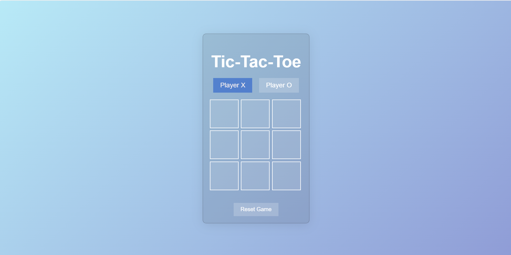
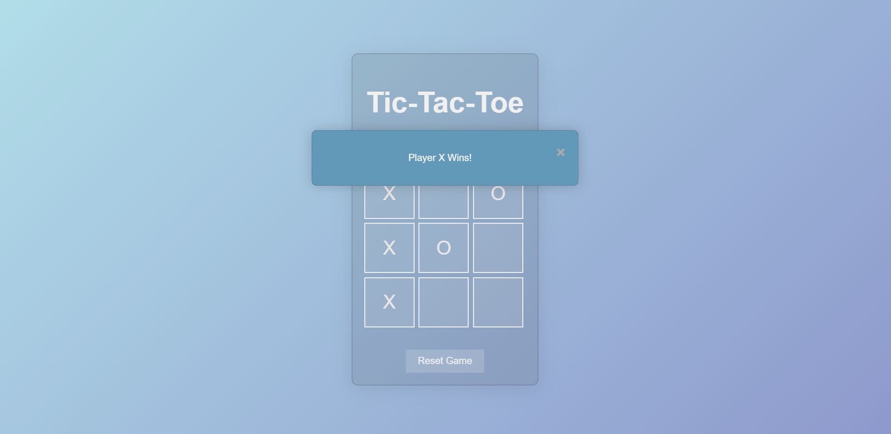

<<<<<<< HEAD
# Tic-Tac-Toe Game

A web-based Tic-Tac-Toe game with a sleek, dark-themed UI and glass effect.

## Description

This project is a simple implementation of the classic Tic-Tac-Toe game using HTML, CSS, and JavaScript. The game features a dark theme and a glass effect for a modern look and feel.

## Features

- Player X and Player O selection
- Interactive game board with hover effects
- Display winner or draw in a dialog box
- Reset game functionality

## Technology Used

- HTML
- CSS
- JavaScript

## Screenshots

- **Screen1:**

- **Screen2:**

- **Screen3:**

## How to Play

1. Select the player (X or O).
2. Click on a cell in the game board to make a move.
3. The game will alternate turns between Player X and Player O.
4. The game will display a dialog box announcing the winner or if there's a draw.
5. Click the reset button to start a new game.

=======
# PRODIGY_WD_03
This project is a simple implementation of the classic Tic-Tac-Toe game using HTML, CSS, and JavaScript.
>>>>>>> 44d52d984ac803ae6f9a9eef06de81f2c574c7ec
